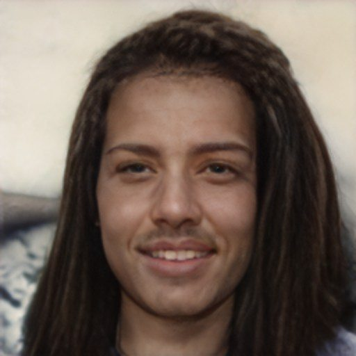

## Usage

### Traing

1.Download the training data and put the decompressed data into the data folder, then Change the data path in train.py (row 263) and dataset_processing.py (row 121).
  ```
  data
    multiFFDI
      phase1
        - trainset
        - valset
        trainset_label.txt
        valset_label.txt
  ```
  train.py (row 263)
  ```
  data_root = "./data/multiFFDI/phase1/" # your data path
  ```
  dataset_processing.py (row 121)
  ```
  prefix_path = "./data/multiFFDI/phase1/trainset/" # your data path
  ```
2.Change the gpu id in train_main.py (row 67).

3.Run the training script:

  ```
  sh run_train.sh
  ```

  After training, the model parameter weights are saved in 'classifier' folder.

### Inference

  Finally, test the model, you can change you own model weights path in test.py (row 58), then you can choose an image and update the image path in test.py (row 64), and run ```python test.py``` to obtain the image score.

### Image Examples
<!-- 

 -->


